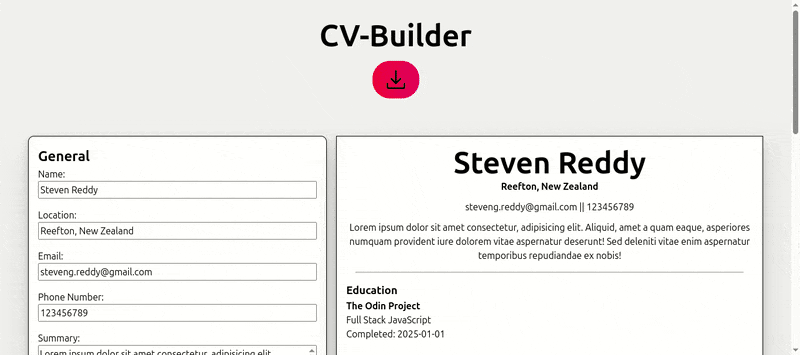
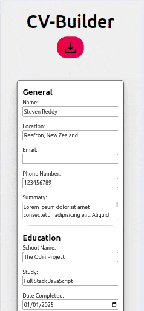

# CV Builder

## Summary

This Project is to create a React app that lets the users input their data and using `useState` be able to keep track of the input and generate a formatted CV for the user to be able to download and print.

## Model

### Index

|  Desktop                                                                      | Mobile                                                                  |
| ----------------------------------------------------------------------------- | ----------------------------------------------------------------------- |
|  |  |

## Project Highlights:

- Using `useState` so the user can see instant changes to their document.
- `@media print` was super valuable when styling the downloadable document, using `display: none;` on most element to hide them to just show the relevant information.
- Keeping the style simple to show off more of the backend and to focus more on using `useState` properly.
- Giving the ability to add more Education and Experience and easily remove them from State. Holding the data a Objects in an array and using `crypto.randomUUID()` to generate a local ID for each piece of information to keep track of.
Project Highlights:
- Using `useState` with immutable update patterns to manage complex nested data structures for education and experience sections.
- Implemented state lifting to centralize CV data while allowing individual components to handle their specific UI states.
- Utilized functional state updates to safely handle asynchronous changes when adding or removing CV sections.

## Challenges Overcome:

- Correctly storing more than one bit of data is State and using both array and object coupled with unique ID's
- Giving the ability to print and save the CV, using `@media print` to style the output.
- Properly organising a React app and separating the app down into components and importing and export correctly.
- Passing through State data correctly using props and handling each data correctly.

## New Skills Acquired:

- Using `useState` and becoming more familiar with how to implement into the app.
- How to add CSS styling to print.
- Passing through props effectively.
- Organising a React app effectively.

## Technologies Used:

- HTML
- CSS
- JavaScript
- React
- Vite
